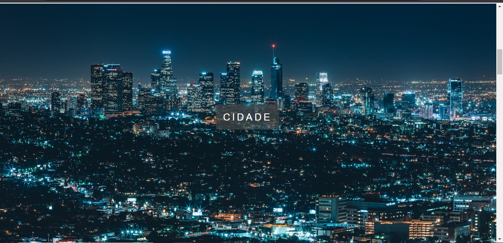
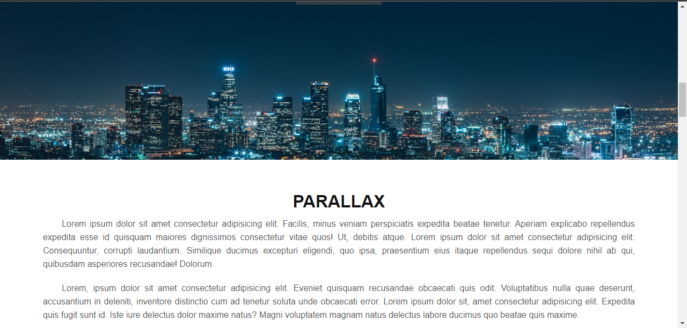

# Parallax

O efeito consiste em manter a imagem de fundo estática enquanto rola o scroll do mouse, além de colocar uma parte com texto que serve como divisor para outras imagens de fundo.

## Feito Com:

Copyright © DavidWillian

